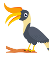

# Copycats - More (Quick) Notes

### CryptoStamps on the Blockchain! (Upcoming)

Exclusive. Archivable. Collectibles.

Learn more @ [crypto-stamps.com](http://crypto-stamps.com), twitter: [crypto_stamps](https://twitter.com/crypto_stamps)

<!--  from reddit answer Dec/29: 
We are a small team based in San francisco. 
The team is composed of developers varying from Carnegie Mellon University and Columbia University.
We are in the process of designing our own unique stamps, and are pursuiant with copyright laws.
-->

### CryptoBunnies on the Blockchain! (Upcoming)

Learn more @
twitter: [CryptoBunniesHQ](https://twitter.com/CryptoBunniesHQ),
reddit: [cryptobunnies](https://www.reddit.com/r/cryptobunnies)

### CryptoBirdies on the Blockchain! (Upcoming)

Buy. Sell. Breed birds. Hatch eggs.

> CryptoBirdies offers a new blockchain experience.
> CryptoBirdies is not just for Making Money. We want users to treat their birds as a real pet. 
> They could Breed, Feed them, and put them in a Open Area where Birds and their owners can interact with each other.

Learn more @
twitter: [CryptoBirdies](https://twitter.com/CryptoBirdies)

