The Future of Digital Collectibles - CryptoKitties, CryptoPuppies, CryptoPets, CryptoMonsters, CryptoTulips - Latest (and Greatest) Investment Opportunities in Online Casino Gambling - The Future is Meow

> - Fabulous Persian Spock Gerbil Gold Cottoncandy - Extremely rare gen 5 swift virgin | 2.9 ETH
> - Rarity: 0.00264% Gen 5 JAGUAR FABULOUS GOLD DALI!! VIRGIN! 
> - Rarity: 0.0015% Princess Bubblegum is now for sale! Gen 12 | Brisk | Virgin | Chartreux | Bubblegum | Otaku | Emeraldgreen | Saycheese | Mauveover | Spock - Starts ETH 20/Ends ETH 10 
> - Gold ducat, Gen 5, Virgin, Swift. Very cheap 
> - Cheap Gen 1 cute kittie with rare genes! Only 0.125 ETH 
> - UNIQUE Virgin Peach Googly Gold Mauveover gen:2 cooldown:1 0.87992% RARE
> - SUPER CHEAP: Gerbil, Ragdoll, Scarlet, Chestnut, Cotton Candy!!! 0.02 ETH (~$14)
> - I'm giving away a Gen 1 FAST Gold for free...
>
> -- [CrypoKittiesMarket](https://www.reddit.com/r/CryptoKittiesMarket)


> Blockchain has unlocked the magic of digital scarcity, and combining that with the power of
> making the digital goods persistent gives them a potential value that is only limited by how much
> prestige a wealthy person might place on ownership of the item.
>
> -- [Justin Poirier](https://twitter.com/tokenizedcap/status/938460753589424128)


> 3 days of up and 19 days of down down down... And the 3 up days were right at the start. Yeah, looking real good.
>
> Nobody wants to pay $300 for a hexadecimal string. That's LITERALLY all you’re buying.
> All the website does is display a picture of a cat. You're paying hundreds of dollars for a picture of a cat. 
> Let that sink in.
>
> This was a modern tulip bubble. You were buying hex strings that tied to the picture of a cat. 
> People were paying 10-20-30 ETH for a cat picture. 10 ETH was around $4000? For a cat picture. Yeah...
>
> -- [CrypoKitties](https://www.reddit.com/r/CryptoKitties)


# Awesome CryptoKitties (& CryptoCopycats)

A collection about Awesome CryptoKitties (Yes, Cute Little Cartoon Cats) on the Blockchain! and CryptoCopycats - digital collectibles secured on a distributed public databases w/ crypto hashes.  Are CryptoPuppies the new CryptoKitties?  Contributions welcome.


Contents

- [CryptoKitties (Yes, Cute Little Cartoon Cats) on the Blockchain!](#cryptokitties-yes-cute-little-cartoon-cats-on-the-blockchain)
  - [Press Coverage](#press-coverage) - _CryptoKitties Mania (Anno 2017)_
  - [Timeline](#timeline) - _Major Milestones in the CryptoKitties History_
  - [Owners / Producers](#owners--producers)
    - [Team](#team) - _Meet the CryptoKitties Makers_
  - [Special Collector's CryptoKitties](#special-collectors-cryptokitties)
  - [Sales Statistics $$$](#sales-statistics)
  - [Articles](#articles)
  - [Money, Money, Money $$$](#money-money-money-) - _Gambling with CryptoKitties - Welcome to the Casino - Get-Rich-Quick_
    - [How Do the Founder Make Money with CryptoKitties?](#how-do-the-founder-make-money-with-cryptokitties)
    - [How Can You Make Money with CryptoKitties?](#how-can-you-make-money-with-cryptokitties)
    - [Scams, Scams, Scams - The Art of the Steal](#scams-scams-scams---the-art-of-the-steal) - _Buyer Beware! Seller Beware! Here Be Dragons!_
    - [Is CryptoKitties a Scam? Is CryptoKitties a Pyramid (Gambling) Scheme? Is CryptoKittes an Online (Gambling) Casino?](#is-cryptokitties-a-scam-is-cryptokitties-a-pyramid-gambling-scheme-is-cryptokittes-an-online-gambling-casino)
      - [Q: Is CryptoKitties a scam?](#q-is-cryptokitties-a-scam)
      - [Q: Are CryptoKitties like dollars or like stuffed animals?](#q-are-cryptokitties-like-dollars-or-like-stuffed-animals)
      - [Q: Is CryptoKitties a pyramid (gambling) scheme?](#q-is-cryptokitties-a-pyramid-gambling-scheme)
      - [Q: Is CryptoKitties an online gambling casino?](#q-is-cryptokitties-an-online-gambling-casino)
  - [Fun, Fun, Fun](#fun-fun-fun) - _Modern Art Paintings (Acryl on Canvas) and More_
  - [Questions & Answers](#questions--answers)
    - [Tech](#tech)
       - [Q: Couldn't CryptoKitties be hosted on many types of databases besides a blockchain?](q-couldnt-cryptokitties-be-hosted-on-many-types-of-databases-besides-a-blockchain)
    - [Legal](#legal)
       - [Q: Do you really own your CryptoKitties?](#q-do-you-really-own-your-cryptokitties) - _Spoiler: No_
    - [Casino & Gambling / "Market & Investing"](#casino--gambling--market--investing)
      - [Q: What's the cost of playing?](#q-whats-the-cost-of-playing)
      - [Q: What's the population? How many gen0 kitties will there be?](#q-whats-the-population-how-many-gen0-kitties-will-there-be)
      - [Q: What's a clock auction?](#q-whats-a-clock-auction)
      - [Q: What make's a kitty good?](#q-what-makes-a-kitty-good)
      - [Q: What are rare traits?](#q-what-are-rare-traits)
  - [Code on the Blockchain - Electronic Contract Scripts](#code-on-the-blockchain---electronic-contract-scripts)
    - [Non-fungible Token (NFT) Standard - Ethereum Request for Comments #721 (ERC-721)](#non-fungible-token-nft-standard---ethereum-request-for-comments-721-erc-721)
  - [Inside CryptoKitties Genetics](#inside-cryptokitties-genetics)
  - [More / Misc](#more--misc)
- [Crypto Copycats on the Blockchain!](#crypto-copycats-on-the-blockchain)
  - [CryptoPuppies (Yes, Cute Little Cartoon Dogs) on the Blockchain! (Upcoming)](#cryptopuppies-yes-cute-little-cartoon-dogs-on-the-blockchain-upcoming)
  - [HashPuppies on the Blockchain! (Upcoming)](#hashpuppies-on-the-blockchain-upcoming)
  - [CryptoPets on the Blockchain! (Upcoming)](#cryptopets-on-the-blockchain--upcoming)
  - [CryptoMons(ters) on the Blockchain! (Upcoming)](#cryptomonsters-on-the-blockchain-upcoming)
  - [CryptoDrome (CryptoHorses) on the Blockchain! (Upcoming)](#cryptodrome-cryptohorses-on-the-blockchain-upcoming)
  - [CryptoFighters on the Blockchain! (Upcoming)](#cryptofighters-on-the-blockchain-upcoming)
  - [CryptoTulips on the Blockchain! (Upcoming)](#cryptotulips-on-the-blockchain--upcoming)
  - [More](#more)
- [History Corner](#history-corner) - _Collectibles on the Blockchain before CryptoKitties_
  - [CryptoPunks on the Blockchain!](#cryptopunks-on-the-blockchain)


## CryptoKitties (Yes, Cute Little Cartoon Cats) on the Blockchain!

Collectible. Breedable. Adorable.

Collect and breed digital cats. Start meow. Buy! Sell! Hold!

> Q: What's CryptoKitties? What's the big deal? 
>
> CryptoKitties is centered around breedable, collectible, and oh-so-adorable creatures 
> we call CryptoKitties! Each cat is one-of-a-kind and 100% owned by you (*); 
> it cannot be replicated, taken away, or destroyed.
>
> CryptoKitties is built on blockchain technology. 
> You can buy, sell, or trade your CryptoKitty like it was a traditional collectible, 
> secure in the knowledge that blockchain will track ownership securely.
> But, unlike traditional collectibles, you can breed two CryptoKitties
> to create a brand-new, genetically unique offspring.
> It results in something special—just like you!

(*): See Q: Do you really own your CryptoKitties? A: Spoiler: No.

Learn more @ [cryptokitties.co](https://cryptokitties.co), 
twitter: [CryptoKitties](https://twitter.com/CryptoKitties),
reddit: [CryptoKitties](https://www.reddit.com/r/CryptoKitties)


> All I want for Christmas is a CryptoKitty.
>
> -- [Kayla Williams](https://twitter.com/kaylaw/status/938590748655550464)

> I got a fever. And the only prescription is more CryptoKitties.
>
> -- [Eduardo Salazar](https://twitter.com/ceduardosalazar/status/938558630663634944)

> [My Gen 7 CryptoKitty #104375](https://www.cryptokitties.co/kitty/104375). The Future is Meow.
>
> -- [Anshul Dhawan](https://twitter.com/TheAnshulDhawan/status/938551642202324993)

> Celebrating 100 000 Kitties!
>
> -- [CryptoKitties](https://twitter.com/CryptoKitties/status/938223161232916481) - Dec/5

> WikiLeaks now accepts #CryptoKitties as a contribution method. 
> In many jurisdictions you can write them down for tax purposes as an investment.
> [Official WikiLeaks CryptoKitties](https://wikileaks.shop/pages/cryptokitties) -
> Purebred WikiLeaks CryptoKitties arrive in time for Christmas.
>  
> -- [WikiLeaks](https://twitter.com/wikileaks/status/944209405377101824)


### Press Coverage

- [**People have spent over $1M buying virtual cats on the Ethereum blockchain**](https://techcrunch.com/2017/12/03/people-have-spent-over-1m-buying-virtual-cats-on-the-ethereum-blockchain/), TechCrunch. Dec/3
- [**CryptoKitties Mania Overwhelms Ethereum Network's Processing**](https://www.bloomberg.com/news/articles/2017-12-04/cryptokitties-quickly-becomes-most-widely-used-ethereum-app), Bloomberg, Dec/4
- [**Introducing CryptoKitties, the New Digital Pets Taking Ethereum by Storm**](http://fortune.com/2017/12/04/blockchain-cryptokitties-ethereum/), Fortune, Dec/4 
- [**This Game Combines The Internet's Favorite Things: Cats & Cryptocurrency**](https://www.youtube.com/watch?v=qk7gRljIKww), Vice, Dec/5
- [**Meet CryptoKitties, the $100,000 digital beanie babies epitomizing the cryptocurrency mania**](https://www.cnbc.com/2017/12/06/meet-cryptokitties-the-new-digital-beanie-babies-selling-for-100k.html), CNBC, Dec/6
- [**Ethereum Network Copes With Surge of Activity as Virtual Kitten Game Goes Viral**](https://blogs.wsj.com/cio/2017/12/07/ethereum-network-copes-with-surge-of-activity-as-virtual-kitten-game-goes-viral/), The Wall Street Journal, Dec/7
- [**CryptoKitties have the digital currency world purring**](http://www.sfchronicle.com/news/article/CryptoKitties-have-the-digital-currency-world-12462575.php),
The San Francisco Chronicle, 
Dec/27 - The digital kitties might not be worth the paper they're not printed on.
- [**Reigning Cats -How to buy cryptocurrency Ethereum – is it worth as much as Bitcoin and what are CryptoKitties?**](https://www.thesun.co.uk/money/5087162/how-to-buy-ethereum-price-cryptocurrency-cryptokitties-bitcoin/), The Sun, Dec/28 - Players can buy and sell virtual cats for as much as $10,000 on the new digital currency - with their rather valuable 'Cattributes'
- [**CryptoKitties, Explained ... Mostly**](https://www.nytimes.com/2017/12/28/style/cryptokitties-want-a-blockchain-snuggle.html), The New York Times, Dec/28 - Why are $20 million and 180,000 people suddenly in the market for digital cats? We gamified the blockchain.


### Timeline

_CryptoKitties History_ 


- 2017 Oct/19 - CryptoKitties alpha test starts at ETH Waterloo (in Ontario, Canada) - an Ethereum hackathon; hundreds of users bred thousands of cats
- 2017 Nov/22 - CryptoKitties contract scripts uploaded onto the public Ethereum blockchain
- 2017 Nov/23 - CryptoKitties closed beta starts; one of the top three most active Ethereum contracts within three hours
- 2017 Nov/28 - CryptoKitties it's official; open to the public - let's wecome everyon to collect, buy, sell, and breed digital cartoon cats on the blockchain
- 2017 Nov/28 - $4_700 USD kitty sold on day of launch
- 2017 Nov/30 - 873 users with an average of 15 kitties each; 19_264 CryptoKitties created or bred; over 120 ETH (~$51_000) in transcations within 1 week; 3.5% of ALL Ethereum transactions (2nd contract on the blockchain)  <!-- source: https://twitter.com/CryptoKitties/status/936349761644273664 -->
- 2017 Dec/2  - Highest selling cat - Kitty #1 (Gen 0, Genesis Exclusive) - sold for Ξ 246.9255 ETH (~$114_481.59) 
- 2017 Dec/5  - ~60k registered users; over $5M USD in transactions; CryptoKitties accounts for ~25% of world-wide Ethereum traffic
- 2017 Dec/6  - Celebrating 100 000 CryptoKitties  <!-- check date? add tweet -->
- 2017 Dec/6  - Highest selling cat - Kitty #4 (Gen 0) - sold for Ξ 247.0000 ETH (~$107_816.49)
- 2017 Dec/7  - Highest selling cat - Kitty #18 (Gen 0) - sold for Ξ 253.3368 ETH (~$110_707.16)
- 2017 Dec/10 - Celebrating 200_000 CryptoKitties
- 2017 Dece/12 - 150k+ registered users; $15M USD in transactions
- 2017 Dec/14 - Celebrating 300_000 CryptoKitties
- 2017 Dec/21  - WikiLeaks Accepts (Sells) CryptoKittes for Donations  <!-- check date? add tweet  -->
- 2017 Dec/24 - Celebrating 400_000 CryptoKitties

_Upcoming (Planed) Milestones_

- Spring 2018  - The CryptoKitties mobile app starts
- Early 2018   - CryptoKitties plans to accept dollars, euros and yen or credit cards as soon as possible.
- November 2018 - The last of the 50_000 Gen 0 CryptoKitties auctioned off to the public; CryptoKitties can now only grow by breeding.


_More (Minor) Milestones_

<!-- break 
     move to traits? -->

- 2017 Dec/3 -  Due to network congestion, we are increasing the birthing fee from 0.001 ETH to 0.002 ETH. This will ensure your kittens are born on time! The extra is needed to incentivize miners to add birthing txs to the chain. Long-term solution will be explored very soon!
- 2017 Dec/4 - DUE TO CONGESTION ON THE NETWORK WE ARE INCREASING THE BIRTHING FEE FROM 0.002 ETH TO 0.015 ETH. WE HOPE THIS WILL ALLOW MORE KITTENS TO BE BORN ON TIME AS THERE HAVE BEEN SIGNIFICANT DELAYS 
- 2017 Dec/6 - WE ARE INCREASING THE RECOMMENDED DEFAULT GAS PRICE FROM 25 TO 40 GWEI IN ORDER TO INCENTIVIZE THE MINERS. AS ALWAYS YOU ARE ABLE TO ADJUST THIS AT YOUR OWN DISCRETION
- 2017 Dec/11 - We have dropped the birthing fee from 0.015 ETH to 0.008 ETH. Happy breeding everyone!
- 2017 Dec/20  - New Trait - Serpent (eye type)
- 2017 Dec/20  - New Trait - Alien (eye type)
- 2017 Dec/22  - New Trait - Hintomint (body color)
- 2017 Dec/22-24 - Winter CryptoKitties Giveaway Contest
- 2017 Dec/28  - New Trait - Elk - Discovered in Kitty #422103. 
- 2017 Dec/31  - New Trait - Icy  - Secondary color (chest color) - white
- 2017 Dec/31  - New Trait - Selkirk - Body type - hair puff with thin tail
- 2017 Dec/31  - New Trait - Flamingo - Secondary color (chest color) - pink
- 2017 Dec/31  - New Trait - Seafoam  - Secondary color (chest color) - green
- 2017 Dec/31  - New Fancy - PhuZiqaat - Best guess recipe = chartreux + spock + alien + pouty


### Owners / Producers

**Axiom Zen** (web: [axiomzen.co](https://www.axiomzen.co), twitter: [axiomzenteam](https://twitter.com/axiomzenteam), github: [axiomzen](https://github.com/axiomzen))

Founded in 2013. Headquarters in Vancouver, British Columbia (BC), Canada.

> Axiom Zen is a venture studio. We specialize in new venture creation - building products and companies
> at the cutting edge of technology.
>
> Our team of fifty founder-quality engineers, product leads, and designers combine a wealth of experience from fast-growing startups
> and companies.

CEO: Roham Gharegozlou - twitter: [rohamg](https://twitter.com/rohamg), angel: [roham](https://angel.co/roham)

> We recommend curating your kitties collection and enjoying the game [for life], 
> as opposed to engaging in [get-rich-quick] speculation. #HODL
> 
> -- [Roham Gharegozlou](https://twitter.com/rohamg/status/940979947916623873)


#### Team

_Meet the CryptoKitties Makers_


(Source: [CryptoKittes For Press / Team](https://www.cryptokitties.co/press))


CryptoKitty Team :

- **Mack Flavelle**  (*) / Product / twitter: [mackflavelle](https://twitter.com/mackflavelle), reddit: [mackflavelle](https://www.reddit.com/u/mackflavelle)
- **Arthur Camara** (*) / Product and Development / twitter: [arthur_camara](https://twitter.com/arthur_camara), reddit: [arthurcamara1](https://www.reddit.com/u/arthurcamara1)
- **Dieter Shirley**  (*)/ Director of Blockchain / twitter: [dete73](https://twitter.com/dete73), reddit: [dete73](https://www.reddit.com/u/dete73), github: [dete](https://github.com/dete)
- **Fabiano Pereira** (*) / Blockchain Contract Scripter / twitter: [FlockonUS](https://twitter.com/FlockonUS), reddit: [flockonus](https://www.reddit.com/u/flockonus)
- **Benny Giang** (*) / Community  / twitter: [BennyGiang](https://twitter.com/BennyGiang), reddit: [nezmoixa](https://www.reddit.com/u/nezmoixa)
- **Layne LaFrance** (*) / Business and Support / twitter: [laynelafrance](https://twitter.com/laynelafrance), reddit: [laynee77](https://www.reddit.com/u/laynee77)
- **Yasmine Nadery** / Marketing
- **Elsa Wilk** / Marketing
- **Bryce Bladon** / Brand and Communications
- **David Huynh** / Design
- **Vivian Hu**  / Design
- **Guile Twardowski** / Art and design
- **Daniela Diaz** / Product
- **Nick Salloum** / Development
- **Maximiliano Castro** / Development
- **Jordan Schalm** / Development
- **Fabio Kenji** / Development
- **Fabiano Soriani** / Development
- **Andrew Burian** / Operations

(*): from the Ask the Team Anything on CryptoKitties Reddit

Mack Flavelle came up with the original idea. 
Mack is the project leader and self-described "fat cat" of CryptoKitties. 

> If you are going to build consumer [gambling casino] products on the internet [blockchain] then you should not explain 
> why you're using cats, but you should explain why you are not using cats.
>
> -- [Mack Flavelle](http://www.cbc.ca/radio/spark/digital-kitties-make-cryptocurrency-more-accessible-1.4443100)


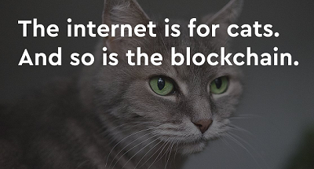


### Special Collector's CryptoKitties

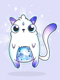

[Genesis Kittie](https://www.cryptokitties.co/kitty/1) #1 (Exclusive Genesis) - Sold for 246.926 ETH (~$115 000) on Dec/2  

Genes `ccac 7787 fa7f afaa 1646 7755 f9ee 4444 6766 7366 cccc eede`

``` json
{"id": 1, "name": "Genesis", "generation":0,
 "created_at":"2017-11-23T06:19:59.000Z",
 "image_url":"https://storage.googleapis.com/ck-kitty-image/0x06012c8cf97bead5deae237070f9587f8e7a266d/1.png",
 "color":"sizzurp",
 "bio":"Greetings, human. I am Genesis. The dogs know me as alpha; the cats know me as omega. To your kind, I am a riddle wrapped in an enigma, first found by a user in Mystery, Alaska. I looked into the void and the void looked back. Then I lost interest. I can’t wait to be your new owner!",
 "is_fancy":true,
 "is_exclusive":true,
 "fancy_type":"Genesis",
 "status":{"is_ready":true,"is_gestating":false,"cooldown":1442286378458,"cooldown_index":0},
 "purrs":{"count":286},
 "auction":{},
 "owner":{"address":"0x79bd592415ff6c91cfe69a7f9cd091354fc65a18","image":"19","nickname":"Stimpson J. Cat"},
 "matron":{},
 "sire":{},
 "children":[],
 "cattributes":[]}
```

(Source: [api.cryptokitties.co/kitties/1](https://api.cryptokitties.co/kitties/1))

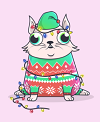
 
[First Xmas Kittie](https://www.cryptokitties.co/kitty/174756) #174756 (Fancy Mistletoe) - Sold for 2.097 ETH	on Dec/10

Genes `cdcd 5656 4744 gfg4 66d4 7877 eccf 251j 77k7 222k gddg ddea`

``` json
{"id":174756, "name":"👑FIRST Mistletoe born!🎄⛄🎅🎁", "generation":8,
 "created_at":"2017-12-09T06:34:56.000Z",
 "image_url":"https://storage.googleapis.com/ck-kitty-image/0x06012c8cf97bead5deae237070f9587f8e7a266d/174756.png",
 "color":"bubblegum",
 "bio":"Heyo! I'm 👑FIRST Mistletoe born!🎄⛄🎅🎁. All you need to know about me is I hate chocolate with a passion. Some people say I'm the Peter Griffin of the group. This will be an amewsing friendship.",
 "is_fancy":true,
 "is_exclusive":false,
 "fancy_type":"Mistletoe",
 "status":{"is_ready":true,"is_gestating":false,"cooldown":1513646373784,"cooldown_index":10},
 "purrs":{"count":2},
 "auction":{"id":343464, "type":"sale",
   "start_price":"10500000000000000000","end_price":"10000000000000000000",
   "start_time":"1513922541000","end_time":"1514095341000",
   "current_price":"10000000000000000000","duration":"172800000","status":"open",
   "seller":{"address":"0x9037382b938117d4a147f460c0a313bd9b793c22","nickname":"earthtraveler","image":"3"}},
 "owner":{"address":"0xb1690c08e213a35ed9bab7b318de14420fb57d8c","image":"16","nickname":"CK Auction Contract 🌻"},
 "matron":{"id":172555,"name":"Oldlace+Gerbil+Gold","generation":7,"owner_wallet_address":"0x2829f8689dc90a60b1d011af2dfb0cf859bd4c48","created_at":"2017-12-09T04:57:44.000Z","image_url":"...","color":"gold","is_fancy":false,"is_exclusive":false,"fancy_type":null,"status":{"is_ready":true,"is_gestating":false,"cooldown":1512905129457}},
 "sire":{"id":169197,"name":"Yay!","generation":6,"owner_wallet_address":"0x2829f8689dc90a60b1d011af2dfb0cf859bd4c48","created_at":"2017-12-09T02:08:19.000Z","image_url":"...","color":"gold","is_fancy":false,"is_exclusive":false,"fancy_type":null,"status":{"is_ready":true,"is_gestating":false,"cooldown":1512901074755}},
 "children":["..."],
 "cattributes":[]}
```

(Source: [api.cryptokitties.co/kitties/174756](https://api.cryptokitties.co/kitties/174756))


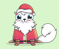

[Ho Ho Ho - First Santa Claus Kittie](https://www.cryptokitties.co/kitty/275808)  #275808 (Fancy SantaClaws) - Sold for 7.258 ETH on	Dec/13

``` json
{"id":275808,"name":"the First SantaClaws! 🎅","generation":6,
 "created_at":"2017-12-12T19:02:00.000Z",
 "image_url":"https://storage.googleapis.com/ck-kitty-image/0x06012c8cf97bead5deae237070f9587f8e7a266d/275808.png",
 "color":"limegreen",
 "bio":"Ciao! I'm the First SantaClaws! 🎅. My friends describe me as raunchy and annoying. When I'm not summoning ghosts, I'm volunteering at the local kitten rescue shelter! I hope you like kitten around as much as I do!",
 "is_fancy":true,
 "is_exclusive":false,
 "fancy_type":"SantaClaws",
 "status":{"is_ready":true,"is_gestating":false,"cooldown":1513108763494,"cooldown_index":4},
 "purrs":{"count":2},
 "auction":{"id":585047,"type":"sale",
   "start_price":"7500000000000000000","end_price":"7500000000000000000",
   "start_time":"1514164770000","end_time":"1514251170000",
   "current_price":"7500000000000000000","duration":"86400000","status":"open",
   "seller":{"address":"0xd28dfb56343774a4b461aa6722870b11ef2abf58","nickname":"kjkjh;kj","image":"17"}},
 "owner":{"address":"0xb1690c08e213a35ed9bab7b318de14420fb57d8c","image":"16","nickname":"CK Auction Contract 🌻"},
 "matron":{"id":261160,"name":"ow+ó!","generation":5,"owner_wallet_address":"0x2f9bfadb9b39e24e6db89e176f7a1d99d6ed9aa8","created_at":"2017-12-12T04:42:09.000Z","image_url":"...","color":"limegreen","is_fancy":false,"is_exclusive":false,"fancy_type":null,"status":{"is_ready":true,"is_gestating":false,"cooldown":1513210822602}},
 "sire":{"id":235050,"name":"Rare Kitty Kawai!","generation":5,"owner_wallet_address":"0x2f9bfadb9b39e24e6db89e176f7a1d99d6ed9aa8","created_at":"2017-12-11T05:39:27.000Z","image_url":"...","color":"gold","is_fancy":false,"is_exclusive":false,"fancy_type":null,"status":{"is_ready":true,"is_gestating":false,"cooldown":1513236004508}},
 "children":["..."],
 "cattributes":[]}
```

(Source: [api.cryptokitties.co/kitties/275808](https://api.cryptokitties.co/kitties/275808))


Celebrating 100 000 CryptoKitties

[Kitty No. 100 000](https://www.cryptokitties.co/kitty/100000) #100000 - Sold for 0.052 ETH on Dec/6

``` json
{"id":100000,"name":"A X","generation":7,
 "created_at":"2017-12-06T01:30:46.000Z",
 "image_url":"https://storage.googleapis.com/ck-kitty-image/0x06012c8cf97bead5deae237070f9587f8e7a266d/100000.svg",
 "color":"strawberry",
 "bio":"Ugh! I'm A X. I believe that one day cats will rule this planet. I put marmalade on everything. Like, everything: hot dogs, ice cream—everything! Let's pawty!",
 "is_fancy":false,
 "is_exclusive":false,
 "fancy_type":null,
 "status":{"is_ready":true,"is_gestating":false,"cooldown":1512535624262,"cooldown_index":5},
 "purrs":{"count":2},"
 auction":{},
 "owner":{"address":"0x38910a53f9fa365a59b804ed707942fe8d9d127d","image":"3","nickname":"Poppy"},
 "matron":{"id":88446,"name":"A3B3-1","generation":6,"owner_wallet_address":"0x959cfe31806d07207116e82b5796e91bb739eab0","created_at":"2017-12-05T13:47:59.000Z","image_url":"...","color":"strawberry","is_fancy":false,"is_exclusive":false,"fancy_type":null,"status":{"is_ready":true,"is_gestating":false,"cooldown":1512541490934}},
 "sire":{"id":97722,"name":"A4B4-1","generation":6,"owner_wallet_address":"0x959cfe31806d07207116e82b5796e91bb739eab0","created_at":"2017-12-05T23:46:57.000Z","image_url":"...","color":"mintgreen","is_fancy":false,"is_exclusive":false,"fancy_type":null,"status":{"is_ready":true,"is_gestating":false,"cooldown":1512537865020}},
 "children":["..."],
 "cattributes":[
  {"description":"lemonade","type":"color"},
  {"description":"bloodred","type":"color"},
  {"description":"munchkin","type":"body"},
  {"description":"greymatter","type":"colorbody"},
  {"description":"strawberry","type":"coloreyes"},
  {"description":"crazy","type":"eyes"},
  {"description":"luckystripe","type":"pattern"},
  {"description":"soserious","type":"mouth"}]}
```

(Source: [api.cryptokitties.co/kitties/100000](https://api.cryptokitties.co/kitties/100000))


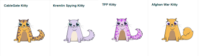

**[Official WikiLeaks CryptoKitties](https://wikileaks.shop/pages/cryptokitties)**.
Purebred WikiLeaks CryptoKitties arrive in time for Christmas.

> How it works. [Mr. WikiLeaks](https://cryptokitties.co/kitty/301923) and [Mrs. WikiLeaks](https://cryptokitties.co/kitty/363461) 
> are two Generation 0 CryptoKitties. WikiLeaks will keep scarcity by breeding only one kitten per week 
> after the initial Christmas litter of 10 (of which only 8 will be for sale). 
> Kitties can be renamed and resold or gifted by their new owners. Their authenticity can be verified on the blockchain.
> WikiLeaks CryptoKitties will be auctioned at a variety of prices, starting at the highest bidding price which will decrease over the 
> course of the four day auction or until a buyer acquires the kitty.


### Sales Statistics


|Date    | Total Sales | Total Unique Kittens | Total Sold (ETH) | Total Sold ($) | Average Sale Price | Median Sale Price  |
|--------|-------------|----------------------|------------------|----------------|--------------------|--------------------|
| Dec/24 |     224 735 |              177 043 |    35 776.17 ETH | $17 575 048.39 |      $78.20        |  $12.62            |
| Dec/9  |      97 830 |               79 233 |    25 699.86 ETH | $12 030 567.96 |     $122.97        |  $23.15            |


(Source: [CryptoKitties Sales](https://kittysales.co))


New Kitties / Day:
- Highest on Dec/10 -  31 642 New Kitties
- Lowest  on Nov/27 -   781 New Kitties

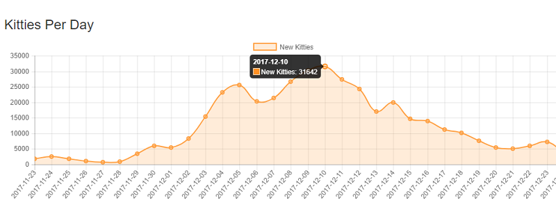


Sales / Day:
- Highest on Dec/10 - 16 993 Kitties Sold

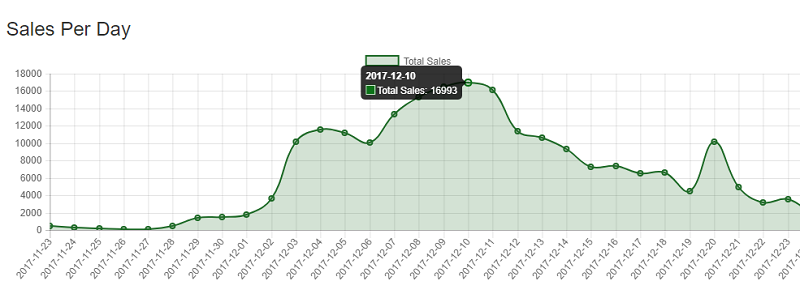

Average Kitty Price / Day:
- Highest on Dec/4 - 0.4185 ETH Average / 0.878 ETH Median

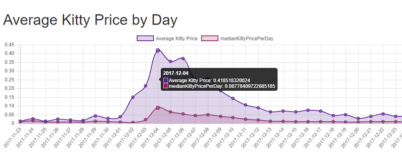


(Source: [Kitty Explorer Stats](http://www.kittyexplorer.com/stats/))


### Articles

_CryptoKitties marks the beginning of a (massive) digital revolution. To understand why, learn about the blockchain, blockchain, blockchain._

[**Why we’re not doing an Initial Coin Offering (ICO)**](https://www.axiomzen.co/news/article/why-were-not-doing-an-initial-coin-offering-ico) by Benny Giang (Axiom Zen, Vancouver, Canada), November 2017 

> CryptoKitties is not holding an Initial Coin Offering (ICO). 
> Instead, we're offering utility from day one and pursuing a sustainable revenue model based on our games' mechanics.

[**Cryptokitties @ Wikipedia**](https://en.wikipedia.org/wiki/Cryptokitties)

> CryptoKitties offers something similar to a cryptocurrency: each CryptoKitty is one-of-a-kind, 100% owned by the user, validated
> through the blockchain, and the value can appreciate or depreciate based on the market.
> Cryptokitties cannot be replicated, taken away, or destroyed. 


[**CryptoKitties & Fun-tier Technologies**](https://medium.com/@vijayssundaram/cryptokitties-fun-tier-technologies-8e73903b98fc)
by Vijay Sundaram, December 2017

> These tokens ought to primarily flow to users and partners who participate in a well-designed economy, 
> rather than just speculate on it. Almost by definition this approach will pay off even if the crypto tide goes out.


[**People are spending $millions on digital cats and here's why it makes sense**](https://medium.com/swlh/people-are-spending-millions-on-digital-cats-and-heres-why-it-make-sense-aea431740bcf) 
by Tony Aubé, December 2017 -- Crypto Kitties is about so much more than cats.

> The blockchain changes everything we thought we knew about computers. 
> By removing one of the computer's biggest feature - the ability to duplicate information - it opens up computing 
> to a multitude of new, real-world use-cases that would have never been possible before.


### Money, Money, Money $$$

_Gambling with CryptoKitties - Welcome to the Casino - Get-Rich-Quick_


(Source: [CryptoKitties have the digital currency world purring, The San Francisco Chronicle](http://www.sfchronicle.com/news/article/CryptoKitties-have-the-digital-currency-world-12462575.php))


#### How Do the Founder Make Money with CryptoKitties?

- The founder auctioned off 100 founder gen 0 kitties on startup.
- The founder auctions off a new gen 0 kitty every 15 minutes until reaching 50 000 gen 0 ktties in November 2018.
  Note: The auction price gets automatically calculated from the last five sales plus 50%.
- The founder get a 3.75% cut (no minimum) on every transaction (selling auction, siring auction, etc.)
  on the official CryptoKitties marketplace.

Note: If you buy kitties you do NOT own the pictures (*) just the 256-bit hex string (on the blockchain),
thus, the founder can sell merchandise or license the pictures for profit. What a franchise!

(*): See Q: Do you really own your CryptoKitties? A: Spoiler: No.


#### How Can You Make Money with CryptoKitties?

No. 1 - Sell your kitties to a greater fool for a higher price!

No. 2 - Put up your kitties for siring (breeding) a new kitty in an auction and earn money for the service! 
The rarer your kitties traits the higher your service fee income!

No. 3 - Breed your own new kitties and sell to a greater fool for a higher price!


#### Scams, Scams, Scams - The Art of the Steal

_Buyer Beware! Seller Beware! Here Be Dragons!_

**Scam #1: Selling Fake Labeled Cheap Kittens Expensive to Newbies (First Timers)**

It's like selling (fake) cheap Gucci handbags for the expensive Gucci price.
Best of both worlds. Buy low, sell high :-). Profit!

Example: I list my gen 15 cat for sale and name it "RARE gen 0 SANTA mom"
and new people not yet understanding how things work buy it.
That was happening ALOT.

Q: Can you please return the cat names to the breeding screen?

_Benny Giang_:
Cat names was an awesome way to have personality in the marketplace but unfortunately,
there were too many people taking advantage
and tricking new users.


**Scam #2: Fake Services Phishing (Stealing) Your Private Keys (Kitties)**

Put up a website that offers to find the perfect soul mate (with machine learing)
for siring new kitties with the rarest of the rarest traits.
Please enter your private key to get started. Thank you!
Now you've got new kitties for free. Profit!

**REMINDER: Trading or selling kitties off of the CryptoKitties marketplace can put your account at EXTREMELY HIGH RISK. NEVER expose your private key on any website for any matter at all. If you do so, you put yourself in a vulnerable position!**

(Source: [CryptoKitties](https://twitter.com/CryptoKitties/status/942799255315521537))


#### Is CryptoKitties a Scam? Is CryptoKitties a Pyramid (Gambling) Scheme? Is CryptoKittes an Online (Gambling) Casino?

First the official answer from the CryptoKitties F.A.Q.:

##### Q: Is CryptoKitties a scam?

> No, this isn’t a scam.
> Anyone with insider knowledge of CryptoKitties - including our developers -
> are banned from participating.
> This is to prevent anyone from using their knowledge of the breeding algorithm
> to create the most valuable kinds of cat.

##### Q: Are CryptoKitties like dollars or like stuffed animals?

> CryptoKitties are NOT a cryptocurrency.
> They're more like a crypto collectible.
> The real-world analogy for a cryptocurrency is dollars or pounds;
a crypto collectible’s real world analogy is closer to stuffed animals beanie babys or fine tulip flower bulps.
>
> As dictated by the contract script on the blockchain, any CryptoKitty you own belongs to you (*).
> Like any product or property you can own, the market price is determined by what a greater fool
> is ready to pay (depending on demand, scarcity, and only limited by your asking price).

(Source: [CryptoKitties F.A.Q.](https://www.cryptokitties.co/faq))

(*): Note: See Q: Do you really own your CryptoKitties? A: Spoiler: No.


---

And here's an independent ("unofficial") answer:

##### Q: Is CryptoKitties a pyramid (gambling) scheme?

Yes, of course. It's gambling. CryptoKitties is designed on purpose for viral spreading.

With human nature is what it is - fear of missing out of getting-rich-quick and so on -
it works everytime like a charm once the hype starts (and prices go up and up).

More and more new greater fools buy more and more 256-bit hex strings (kitties on the blockchain)
until in the end running out of new greater fools paying ever higher prices.

Facebook has more than 1 000 000 000+ internet user. CryptoKitties is world-wide.
Will CryptoKitties ever run out of new greater fools?

> - Selling a lot of GEN1-3 for less than .2 | Fire Sale
> - Selling all kitties for .45 ETH - 9 kitties, quick cooldowns, early generations, rare traits
> - Selling account with 9 kitties (GEN1 - 2 cats, GEN2 - 5 cats, GEN3 - 2 cats), price = ETH 1.2
> - Selling almost 100 kitties!
> - Sell all my kitties for a great price!
> - Selling whole Account with 10 ultra amur cats. Perfect Starter. (For only 0.25 ETH). Fastest gets it.
> - Selling all kitties for .45 ETH - 9 kitties, quick cooldowns, early generations, rare traits
> - Selling whole account with 18 good kitties (10 amurs, rare traits, 1 fancy, max gen.3-9) - Make me an offer!
>
> -- [CrypoKittiesMarket](https://www.reddit.com/r/CryptoKittiesMarket)


##### Q: Is CryptoKitties an online gambling casino?

Gambling vs Investing

> Investments are generally not considered gambling when they meet the following criteria:
>
> - Economic utility
> - Positive expected returns (at least in the long term)
> - Underlying value independent of the risk being undertaken
>
> -- [What's Gambling @ Wikipedia](https://en.wikipedia.org/wiki/Gambling)

For example, the mixing of genomes when breeding (siring) new kitties is a modern
"masqueraded" or fun way to roll a dice or spin a roulette wheel.
The betting (wagering) on rare traits is a modern "masqueraded" or fun
way of betting (wagering) on lucky numbers.

And, of course, the kitties
are a modern "masqueraded" or fun way of casino "funny money" tokens
rebranded as digital "virtual" cat collectibles or
non-fungible tokens (N.F.T.s).

**BEWARE: Gambling is fun and addictive. Winning and losing. Up and down.
Treat CryptoKittes as entertainment like casino gambling, sports betting or poker cards playing.
Do NOT "invest" trying to get-rich-quick
or raise the stakes trying to win back what you have lost, and so on.**


### Fun, Fun, Fun


#### CryptoKitties Art

Buy Fine Crypto Kitty Art Paintings (Acryl on Canvas) - Original (*) Modern Art?! 


(*): Yes, you really really own the painting.

> Everybody is going nuts about CrypoKitties ( including myself ) So, as a painter my madness is reflected in art; 
> so I've started to paint this kitties... lot's of kitties :)

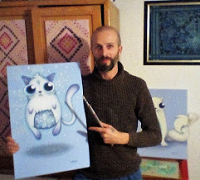

Learn more @ [cryptokittiesart.blogspot.com](https://cryptokittiesart.blogspot.com), twitter: [CryptoKityArt](https://twitter.com/CryptoKityArt)


### Questions & Answers

#### Tech

##### Q: Couldn't CryptoKitties be hosted on many types of databases besides a blockchain?

> A: Crypto-collectibles have key properties that proprietary digital collectibles didn't: 
> longevity, code-enforced scarcity and rules, resistance to actions of sponsoring company. 
> Much closer to non-digital collectibles like baseball cards than pre-crypto digital goods.
>
> -- [Chris Dixon](https://twitter.com/cdixon/status/937671322724982784)


#### Legal

##### Q: Do you really own your CryptoKitties?

> A: Spoiler: No.
>
> CryptoKitties are made up of two pieces: the DNA written to the blockchain, and the graphics 
> assembled to represent each CryptoKitty. Axiom Zen owns the graphics, 
> and makes it clear you have no rights to those in their Terms of Use.
>
> -- [Greg McMullen](https://medium.com/@gmcmullen/do-you-really-own-your-cryptokitties-d2731d3491a9)


#### Casino & Gambling / "Market & Investing"

##### Q: What's the cost of playing?

A: Costs:

- Buying a cat.  (For sale / Buy now price varies; see [Marketplace / For Sale](https://www.cryptokitties.co/marketplace))
- Hiring a sire for your cat.  (Want to sire / Breed now price varies; see [Marketplace / Siring](https://www.cryptokitties.co/marketplace/siring))
- Breeding @ 0.008 ETH (*)

Fees:

- 3.75% Sales fee. (When you successfully sell or sire a cat on the marketplace.)
- Gas fees (**). These are transactions fees. Every time you start a transaction on the blockchain, you have to pay the "miners" to run the task. Transactions with gas fees incl.:
  - Buying a cat / hiring a sire.
  - Breeding.
  - Putting a cat up for auction (sell or sire).
  - Taking a cat down from auction (sell or sire). [Note: Note: If you cat doesn't sell, it stays up for auction until you take it down.]


(*): The breeding fee was at first 0.001 ETH. Due to high transaction traffic on the blockchain
  the founders had to raise the fee because the breeding fee has to be higher than gas fees to birth a new kitty.

(**): The gas fee is shown before you send off a transaction. It is roughly between $0.30 - $3.00 
 (depending on blockchain traffic).


<!-- old text
* Price of kitties that you purchase.
* Fees for breeding two kitties together (about $0.50 to $0.60 as of 3rd December 2017).
* Fees for listing the sale auction to sell your kitties (about $0.20 as of 3rd December 2017).
* Additional funds in your wallet to allow the transactions to occur.
-->


##### Q: What's the population? How many gen0 kitties will there be?

A: 50_000 Gen 0 Kitties

- CryptoKitties started with 100 founder kitties - see #1 (Genesis!) to #100.
- Every 15 minutes a new gen0 kitty (also known as "clock cat")
  gets added (that is, 4 gen0 kitties/hour, 96 gen0 kitties/day, 672 gen0 kitties/week)
  and sold by (dutch) clock auction (*) until reaching a limit of 50_000 in one year (end of November 2018) - 
  see #1001 for first clock cat. 

(*): A gen0 kitty's start price is automatically calculated by the average price 
of the last five kitty sales, plus 50% and sold by a descending clock auction; see [Marketplace / Gen 0](https://www.cryptokitties.co/marketplace/gen0).


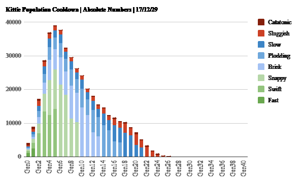

(Source: [Statistical Data on CryptoKitties](https://sites.google.com/view/catstats/))


<!-- old chart

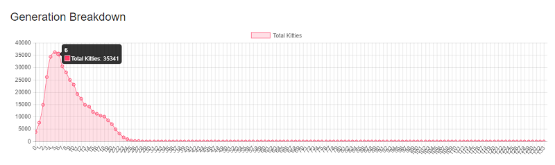

(Source: [Kitty Explorer / Generation Breakdown](http://www.kittyexplorer.com))
   -->

##### Q: What's a clock auction?

It's an auction with an automatically calculated descending price by clock (that is, the prices depends on the time of the purchase). 
Sellers choose a high opening bid, a minimum closing bid, and a timeframe for the auction to run.
Buyers choose their purchase price along that spectrum by purchasing when the price aligns with their perceived value of the CryptoKitty being sold - as long as someone else doesn't buy it befor. 
Note: Buyers pay gas when they complete a purchase and sellers pay gas to start an auction. 


##### Q: What make's a kitty good?

A: The generation, cooldown speed, traits, and all affect the overall price and desirability of the kitties.
Generally, anything gen(eration) 0/1/2/3/4, with fast/swift/snappy/brisk is a good kitty. Rare traits make it even better.

**Generation.** The best generation of kitty is Gen 0. 
The lower the generation number, the better starting cooldown the kitty is born with. 

When breeding two kitties together, the resulting generation will be one higher than the highest generation parent. 
For example:

* If a Gen 0 and Gen 0 breed, the kitten will be Gen 1. 
* If a Gen 5 and Gen 5 breed, the kitten will be Gen 6.
* If a Gen 0 and a Gen 5 breed, the kitten will be Gen 6.

**Cooldowns.**  Each time a kitty breeds another kitty it needs a
period of cooldown time to recover. The cooldown wait time increases every time
a kitty breeds until it reaches "catatonic" cooldown, where it will remain.

Note: Cooldowns - 
fast (1m) › swift (2m·5m) › snappy (10m·30m) › brisk (1h·2h) › 
plodding (4h·8h) › slow (16h·24h) › sluggish (2d·4d) › catatonic (1w) - 
are NOT inherited but depend on the generation, that is,  
each new kitty is born with a cooldown based on its generation (gen).

|  Gen      | (+) Kids |  Cooldown  | Time to Recover |
|-----------|----------|------------|-----------------|
|   0 · 1   |          | Fast       | 1 minute        |
|   2 · 3   |          | Swift      | 2 minutes       |
|   4 · 5   |          | -^^^-      | 5 minutes       |
|   6 · 7   |          | Snappy     | 10 minutes      |
|   8 · 9   |          | -^^^-      | 30 minutes      |
|  10 · 11  |          | Brisk      | 1 hours         |
|  12 · 13  |          | -^^^-      | 2 hours         |  
|  14 · 15  |          | Plodding   | 4 hours         |
|  16 · 17  |          | -^^^-      | 8 hours         |
|  18 · 19  |          | Slow       | 16 hours        |
|  20 · 21  |          | -^^^-      | 24 hours        |
|  22 · 23  |          | Sluggish   | 2 days          |
|  24 · 45  |          | -^^^-      | 4 days          |
|  26+      |          | Catatonic  | 1 week          |
 
Examples:

A gen 2 kitty will start off with a swift 2 minutes cooldown when born, 
and a gen 14 will be born with a plodding 4 hours cooldown.

A gen 11 kitty virgin will start off with a brisk 1 hours cooldown (slot gen 10·11) when born,
but after having 3 kids will end up 3 slots down with a plodding 8 hours cooldown (slot gen 16·17).


<!-- old official (simpler) cooldown table

| Cooldowns  | Time to recover |
|------------|-----------------|
| Fast       |              1m |
| Swift      |         2m - 5m |
| Snappy     |       10m - 30m |
| Brisk      |         1h - 2h |
| Plodding   |         4h - 8h |
| Slow       |       16h - 24h |
| Sluggish   |         2d - 4d |
| Catatonic  |          1 week |

-->


**Traits.** Certain traits are rarer than others, making the Kitty more desirable. 
As more kitties are bred with these traits and new traits are discovered, the value of each one can change.

Traits include:

- Body and Tail: Chartreux Cymric Himalayan Laperm Mainecoon Munchkin Ragamuffin Sphynx
- Pimary Color: Mauveover Cloudwhite Cottoncandy Salmon Shadowgrey Orangesoda Topaz Greymatter Cottoncandy Oldlace
- Secondary Color: Peach Bloodred Emeraldgreen Granitegrey Kittencream
- Pattern: Spock Tigerpunk Calicool Luckystripe Jaguar Totesbasic
- Pattern Color: Barkbrown Cerulian Chocolate Coffee Lemonade Royalpurple Scarlet Skyblue Swampgreen Violet Wolfgrey
- Eye Type: Wingtips Fabulous Otaku Raisedbrow Simple Crazy Thicccbrowz Googly
- Eye Color / Background Color: Bubblegum Chestnut Gold Limegreen Mintgreen Sizzurp Strawberry Topaz
- Mouth:  Whixtensions Dali Saycheese Beard Tongue Happygokitty Pouty Soserious Gerbil

##### Q: What are rare traits?

A: Use these website services:

- [CryptoKittydex Cattributes](https://cryptokittydex.com/cattributes) 
- [Kitty Explorer Cattributes](http://www.kittyexplorer.com/kitties/?cattributes=whixtensions)

Currently 
hintomint (144 kitties), alien (652 kitties),  serpent (900 kitties),  manx (1 082 kitties),  
hotrod (1 223 kitties), daffodil (1 347 kitties) are the three rarest.
 
<!-- was:
oldlace (81 kitties), wolfgrey (146 kitties), and gerbil (185 kitties)
-->

Example:

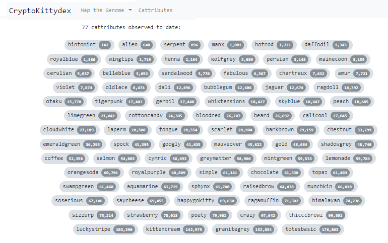

(Source: [CryptoKittydex / Cattributes](https://cryptokittydex.com))

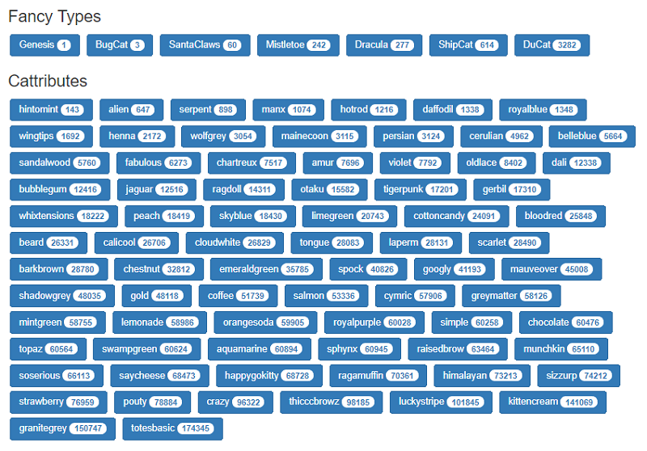

(Source: [Kitty Explorer / Cattributes](https://cryptokittydex.com))


See the [Crypto Kitty World F.A.Q.](http://cryptokittyworld.com/faq/) 
or the [Crypto Kitties Wiki](http://cryptokitties.wikia.com/wiki/CryptoKitties_Wiki) for many more questions and answers.


#### More Questions & Answers

Ask the [CryptoKitty team anything! @ CryptoKitties Reddit](https://www.reddit.com/r/CryptoKitties/comments/7kowyy/ask_the_cryptokitty_team_anything/) - Dec/14

CryptoKitty Team @ Axiom Zen (Vancouver, Canada) Attending:

- Arthur Camara / Developer
- Fabiano Pereira / Smart Contract Developer
- Dieter Shirley / Technical Architect 
- Mack Flavelle / Product 
- Benny Giang / Product 
- Layne LaFrance / Product 

**Q: Where do you see CryptoKitties 6 months from now?**

_Arthur Camara_:
6 months from now: there'll be tons of new genes, fancy cats, new features that enhance the gameplay. Managing larger collections will be easy and fun. Cats of all prices will be meaningful and we'll find new ways for people to play with their kitties. We want to enhance the meaning of ownership and make it even more fun.

  * * *
   
**Q: We have 365k kitties now and under 196k total sales (kitties traded or sired). 
That combined with the drop in values suggests that the demand isn't keeping pace with the supply
[...] causing the market to tank. What do you think caused the crash? 
Are you working on strategies to increase kitty values or do you want the value to stabilize at $1 per cat or so as rumored?**

**Q: Any plans to make the market more sustainable for small investors? 
Currently, someone who invests only $10 can barely buy two kitties, let alone cover the cost to breed them. 
To make that worse, the likelihood that they'll be able to sell the offspring is minimal. What's your take?**

**Q: Any modification in plan regarding the mass supply of Gen 0s overcoming the demand?**

_Mack Flavelle_: To be honest, the market has been unpredictable for users and for us. We don't have any more visibility 
on what will happen next than any other user.

The market excelled much more quickly than we expected - the Gen 0 pricing is 50% more than the average of the last 5 kitties so it is completely determined by the market not us.

We really do believe that long term the kitties will capture a ton of value for users and fans, 
but it's important to remember that CryptoKitties is a decentralized game. 
We have very little control on the economy for good or for bad. 

Q1 of 2018 we have plans to stabilize the economy and reduce the volatility - in the long run we believe the kitties will be valuable.

Over time the economy will expand to be truly fun and valuable for high net worth players and new, exploratory players - a bigger, healthier economy creates value for everyone inside it. 


_Arthur Camara_: 
I believe we're building long term value to CryptoKitties with amazing features that are coming, new ways to play with the kitties, 
new interactions. And remember: there will only ever be 50,000 gen0 kitties, we are constantly adding features, fancy kitties are constantly being discovered.


_Benny Giang_: There are some interesting ideas around limiting the supply of kitties that we will explore in 2018.


**Q: Please let us have an option to recycle / trash worthless kitties in exchange for something.**

_Benny Giang_: Yup, a "kitty sink" could be useful for the market 
but there are also various of other viable solutions.


**Q: Where do you see CryptoKitties 6 years from now?**

_Arthur Camara_: CryptoKitties will be a global brand (way before that, actually). 
People will give CryptoKitties to their children 
on their first birthday. There'll be a complex ecosystem around the game, with lots of features and tools.


### Code on the Blockchain - Electronic Contract Scripts


#### Contract Structure

> The day-one functionality of the contract scripts includes:
>                
> - Keep track of the genes of upcoming gen0 CryptoKitties
> - Introducing the genes of gen0 CryptoKitties to the Core Contract
> - Launching the auctions for gen0 CryptoKitties (including price determination)
> - Combining the genotypes of two parent CryptoKitties to determine the genotype of the new CryptoKitten
> - Managing the auctions of CryptoKitties (both gen-0 cats being auctioned to users and user-to-user auctions) and siring tokens
> - Managing siring auctions (including initiating the breeding when successful).
>
>  All functionality for breeding, buying, selling, and transferring cats 
> will be possible for any user by interacting directly with the contracts on the blockchain.
> Any auctions or sales conducted through our auction contract 
> will include a 3.75% commission (no minimum) taken from the seller's portion.

(Source: [CryptoKitties Technical Details / Contract Structure](https://www.cryptokitties.co/Technical-details))


#### Contract Script (Public) Source Code

[CryptoKittiesCore.sol](CryptoKittiesCore.sol) in Ethereum Solidity -- copied from [Etherscan](https://etherscan.io/address/0x06012c8cf97bead5deae237070f9587f8e7a266d#code)

More contract scripts

- [Sale auction](https://etherscan.io/address/0xb1690c08e213a35ed9bab7b318de14420fb57d8c#code)
- [Siring auction](https://etherscan.io/address/0xc7af99fe5513eb6710e6d5f44f9989da40f27f26#code)

<!-- add why? why not?
- [CEO](https://etherscan.io/address/0xaf1e54b359b0897133f437fc961dd16f20c045e1)
- [CFO](https://etherscan.io/address/0x2041bb7d8b49f0bde3aa1fa7fb506ac6c539394c)
- [COO](https://etherscan.io/address/0xa21037849678af57f9865c6b9887f4e339f6377a)
  -->


#### Non-fungible Token (NFT) Standard - Ethereum Request for Comments #721 (ERC-721)

_CryptoKitties provides a practical use case for digital scarcity 
and digital collectibles by pioneering ERC-721, a non-fungible token protocol_


A standard interface allows any Non-fungible Token (NFTs) on Ethereum 
to be handled by general-purpose applications. 
In particular, it will allow for Non-fungible Token (NFTs) 
to be tracked in standardized wallets and traded on exchanges.


Compatibility Functions for Ethereum Request for Comments #20 (ERC-20)

- function **name**() constant returns (string name)
- function **symbol**() constant returns (string symbol)
- function **totalSupply**() constant returns (uint256 totalSupply)
- function **balanceOf**(address _owner) constant returns (uint256 balance)

Basic Ownership Functions

- function **ownerOf**(uint256 _tokenId) constant returns (address owner)
- function **approve**(address _to, uint256 _tokenId)
- function **takeOwnership**(uint256 _tokenId)
- function **transfer**(address _to, uint256 _tokenId)
- function **tokenOfOwnerByIndex**(address _owner, uint256 _index) constant returns (uint tokenId)

Metadata Functions

- function **tokenMetadata**(uint256 _tokenId) constant returns (string infoUrl)

Events

- event **Transfer**(address indexed _from, address indexed _to, uint256 _tokenId)
- event **Approval**(address indexed _owner, address indexed _approved, uint256 _tokenId) 


(Source: [Ethereum, Non-fungible Token (NFT) Standard #721](https://github.com/ethereum/EIPs/issues/721))


#### More About Contract Scripts

For more contract scripts see:

**The CryptoKitty Bounty Program** (github: [axiomzen/cryptokitties-bounty](https://github.com/axiomzen/cryptokitties-bounty)) 

> CryptoKitties is composed of 4 public facing contracts. Below we'll provide an overview on these contracts:
>
> ##### KittyCore.sol - `0x16baf0de678e52367adc69fd067e5edd1d33e3bf`
>
> Also referred as the main contract, is where Kitties and their ownership are stored.
> This also mediates all the main operations, such as breeding, exchange, and part of auctions.
> 
> For this release, the actual bytecode released for the contract is `KittyCoreRinkeby.sol`, explained below.
> 
> ##### SaleClockAuction.sol - `0x8a316edee51b65e1627c801dbc09aa413c8f97c2`
> 
> Where users are expected to acquire their gen0 kitten. It is also a marketplace where anyone can post their kitten for auction.
> [See Dutch/Clock auction](https://en.wikipedia.org/wiki/Dutch_auction) - note we also accept an increasing price.
> ps: CryptoKitties auctions take an initial time and duration, and after duration is over they are not closed. 
> Instead they hold the final price indefinitely
>
> ##### SiringClockAuction.sol - `0x07ca8a3a1446109468c3cf249abb53578a2bbe40`
>
> A marketplace where any user can offer their Kitty as a potential sire for any takers.
>
> ##### GeneScience.sol
>
> It's a mystery! Not public for this release.
>
>
> [...]
>
> ### Common functions
>
> Here's what we expect to be the most usual flow, and what function are to be called.
>
> 1. COO will periodically put a kitten to gen0 auction (Main `createGen0Auction()`)
> 1. user go an buy gen0 kittens (Sale Auction `bid()`)
> 1. user can get kitty data (Main `getKitty()`)
> 1. user can breed their own kittens (Main `breedWith()` or `breedWithAuto()`)
> 1. after cooldown is passed, any user can have a pregnant kitty giving birth (Main `giveBirth()`)
> 1. user can offer one of their kitties as sire via auction (Main `createSiringAuction()`)
> 1. user can offer their kitty as sire to another user (Main `approveSiring()`)
> 1. user can bid on an active siring auction (Main `createSiringAuction()`)
> 1. user can put their kitty for sale on auction (Main `createSaleAuction()`)
> 1. user can buy a kitty that is on auction from another user (Sale Auction `bid()`)
> 1. user can check info of a kitty that is to auction (Sale/Siring Auction `getAuction()`)
> 1. user can cancel an auction they started (Sale/Siring Auction `cancelAuction()`)
> 1. user can transfer a kitty they own to another user (Main `transfer()`)
> 1. user can allow another user to take ownership of a kitty they own (Main `approve()`)
> 1. once an user has a kitty ownership approved, they can claim a kitty (Main `transferFrom()`)
> 1. CEO is the only one that may replace COO or CTO (Main `setCEO()` `setCFO()` `setCOO()`)
> 1. COO can mint and distribute promotional kittens (Main `createPromoKitty()`)
> 1. COO can transfer the balance from auctions (Main `withdrawAuctionBalances()`)
> 1. CFO can drain funds from main contract (Main `withdrawBalance()`)
>
> -- [Basics of CryptoKitties](https://github.com/axiomzen/cryptokitties-bounty/blob/master/CryptoKitty%20Basics.md)


### Inside CryptoKitties Genetics

_cdcd 5656 4744 gfg4 66d4 7877 eccf 251j 77k7 222k gddg ddea_


The 256-bit genome (genes) have over 4-billion variations of phenotypes (what you see) 
and genotypes (what you don't see).


[**The CryptoKitties Genome Project**](https://medium.com/@kaigani/the-cryptokitties-genome-project-68582016f687) by Kai, Dec 19 

> Here's what I've found:
> - Genes are stored in 12 blocks of 4x5-bit codes
> - Each 5-bit code represents a cattribute associated with the position in the gene (body, pattern type, eye color, eye type, primary color, pattern color, secondary color, fancy type, mouth)
> - Each block of 4 codes represents 1 dominant trait expressed in the Kitty followed by 3 recessive traits.
> - Codes are passed from either parent to child, with a low probability of swapping from the 1st recessive, and a lower probability of swapping from the 2nd or 3rd recessive.
> [...]


(Source: [CryptoKittydex, Kaittributes](https://cryptokittydex.com/kaittributes))


[**The CryptoKitties Genome Project: On Dominance, Inheritance and Mutation**](https://medium.com/@kaigani/the-cryptokitties-genome-project-on-dominance-inheritance-and-mutation-b73059dcd0a4) by Kai, Jan 6, 2018 -- Genome, deciphered

> The genome represents 12 groups of 4 genes. 
> Each group of 4 genes maps to a given cattribute trait.
> Within each group of 4 genes, there are 3 recessive genes [R1, R2, R3] 
> and 1 dominant gene [D1] which will be reflected as a cattribute for that trait, 
> represented in the appearance of that kitty.
>
> [...]
>
> Here is a quick sketch of the relative odds of getting a specific gene from the parents
>
> - 75% - either dominant gene [D1] from parent A or B
> - 18.75% (75/4) - chance of getting either 1st recessive [R1] from A or B
> - 4.69% (75/4²) - chance of getting either 2nd recessive [R2] from A or B
> - 1.17% (75/4³) - chance of getting either 3rd recessive [R3] from A or B
> - 25% - chance of getting a mutation given A & B contain the right gene pairs


Q: What's kai notation (base58)?

Kai notation (named to honor Kai who deciphered the kitties genome)
is a base58 variant for decoding the 256-bit integer into 5-bit blocks.
Each 5-bit block is a gene. The 256-bit genome breaks down into 12 groups of 4 (x 5-bit) genes (that is, 12 x 4 x 5-bit = 240 bits) 
Example:

|Kai    |Binary |Num|Kai    |Binary |Num|Kai    |Binary |Num|Kai    |Binary |Num|
|-------|-------|---|-------|-------|---|-------|-------|---|-------|-------|---|
| **1** | 00000 | 0 | **9** | 01000 | 8 | **h** | 10000 |16 | **q** | 11000 |24 |
| **2** | 00001 | 1 | **a** | 01001 | 9 | **i** | 10001 |17 | **r** | 11001 |25 |
| **3** | 00010 | 2 | **b** | 01010 | 10| **j** | 10010 |18 | **s** | 11010 |26 |
| **4** | 00011 | 3 | **c** | 01011 | 11| **k** | 10011 |19 | **t** | 11011 |27 |
| **5** | 00100 | 4 | **d** | 01100 | 12| **m** | 10100 |20 | **u** | 11100 |28 |
| **6** | 00101 | 5 | **e** | 01101 | 13| **n** | 10101 |21 | **v** | 11101 |29 |
| **7** | 00110 | 6 | **f** | 01110 | 14| **o** | 10110 |22 | **w** | 11110 |30 |
| **8** | 00111 | 7 | **g** | 01111 | 15| **p** | 10111 |23 | **x** | 11111 |31 |

Note: The digit-0 and the letter-l are NOT used.

> Base58 is a group of binary-to-text encoding schemes used to represent large integers as alphanumeric text.
> It is similar to Base64 but has been modified to avoid both non-alphanumeric characters 
> and letters which might look ambiguous when printed [e.g. 1 and l, 0 and o]. 
> It is therefore designed for human users who manually enter the data, 
> copying from some visual source, but also allows easy copy 
> and paste because a double-click will usually select the whole string.
>
> [-- Base58 @ Wikipedia](https://en.wikipedia.org/wiki/Base58)


Example - Eyes Gene Mapping (Bits 12 to 15) - Kai-to-Cattributes ("Kaittributes"):

|Kai|Cattribute   |Kai|Cattribute  |Kai|Cattribute  |Kai|Cattribute  |
|---|-------------|---|------------|---|------------|---|------------|
| 1 | ??          | 9 | ??         | h | ??         | q | ??         |
| 2 | wonky       | a | ??         | i | alien      | r | wingtips   |
| 3 | serpent     | b | ??         | j | fabulous   | s | ??         |
| 4 | googly      | c | ??         | k | raisedbrow | t | ??         |
| 5 | otaku       | d | ??         | m | ??         | u | ??         |
| 6 | simple      | e | ??         | n | ??         | v | ??         |
| 7 | crazy       | f | ??         | o | ??         | w | ??         |
| 8 | thicccbrowz | g | stunned    | p | ??         | x | ??         |

Note: ?? - "rare" cattribute not yet seen in kitties


Example - Body Gene Mapping (Bits 0 to 3)  

|Kai|Cattribute   |Kai|Cattribute  |Kai|Cattribute  |Kai|Cattribute  |
|---|-------------|---|------------|---|------------|---|------------|
| 1 | ??          | 9 | ??         | h | ??         | q | ??         |
| 2 | selkirk     | a | cymric     | i | ??         | r | ??         |
| 3 | ??          | b | chartreux  | j | ??         | s | ??         |
| 4 | ??          | c | himalayan  | k | ??         | t | manx       |
| 5 | ??          | d | munchkin   | m | ??         | u | ??         |
| 6 | ??          | e | sphynx     | n | mainecoon  | v | ??         |
| 7 | ??          | f | ragamuffin | o | laperm     | w | ??         |
| 8 | ??          | g | ragdoll    | p | persian    | x | ??         |

Note: ?? - "rare" cattribute not yet seen in kitties


[**CryptoKitties mixGenes Function**](https://medium.com/@sean.soria/cryptokitties-mixgenes-function-69207883fc80) by Sean Soria, Dec 22

> The mixGenes function gets called when you breed two cats. This is how the baby's genes are calculated. [...]
> Here’s the pseudocode to start:

```
def mixGenes(mGenes[48], sGenes[48], babyGenes[48]):
  # PARENT GENE SWAPPING
  for (i = 0; i < 12; i++):
    index = 4 * i
    for (j = 3; j > 0; j--):
      if random() < 0.25:
        swap(mGenes, index+j, index+j-1)
      if random() < 0.25:
        swap(sGenes, index+j, index+j-1)
  # BABY GENES
  for (i = 0; i < 48; i++):
    mutation = 0
    # CHECK MUTATION
    if i % 4 == 0:
      gene1 = mGene[i]
      gene2 = sGene[i]
      if gene1 > gene2:
        gene1, gene2 = gene2, gene1
      if (gene2 - gene1) == 1 and iseven(gene1):
        probability = 0.25
        if gene1 > 23:
          probability /= 2
        if random() < probability:
          mutation = (gene1 / 2) + 16
    # GIVE BABY GENES
    if mutation:
      baby[i] = mutation
    else:
      if random() < 0.5:
        babyGenes[i] = mGene[i]
      else:
        babyGenes[i] = sGene[i]
```


[**CryptoKitties GeneScience algorithm**](https://medium.com/@alexhegyi/cryptokitties-genescience-1f5b41963b0d) by Alex Hegyi, Dec 23

> My winter holiday thus far has consisted of staring at disassembled bytecode 
> until I had everything figured out:

``` python

# These examples are from Tx 0xa7b0ac87684771f6d6204a09b5a0bf0b97f6adf61b78138e8fd264828e36b956

# matron.genes
arg1 = 0x000063169218f348dc640d171b000208934b5a90189038cb3084624a50f7316c

# sire.genes
arg2 = 0x00005a13429085339c6521ef0300011c82438c628cc431a63298e3721f772d29

# matron.cooldownEndBlock - 1
arg3 = 0x000000000000000000000000000000000000000000000000000000000047ff27

# BLOCKHASH of block number equal to arg3
blockhash = 0xf9dd4486d68b13839d2f7b345f5223f17abae39a951f2cea5b0ca0dd6dc8db83


# load arguments into bytes arrays in big-Endian order

args1 = []
for cnt in range(32):
    args1.append(arg1//((1<<8)**cnt)&0xff)
args1.reverse()
args1 = bytes(args1)

args2 = []
for cnt in range(32):
    args2.append(arg2//((1<<8)**cnt)&0xff)
args2.reverse()
args2 = bytes(args2)


args3 = []
for cnt in range(32):
    args3.append(arg3//((1<<8)**cnt)&0xff)
args3.reverse()
args3 = bytes(args3)

blockhashes = []
for cnt in range(32):
    blockhashes.append(blockhash//((1<<8)**cnt)&0xff)
blockhashes.reverse()
blockhashes = bytes(blockhashes)

# concatenate bytes arrays

alls =  blockhashes + args1 + args2 + args3


# get hash of bytes arrays. This is your source of "randomness"

hash = sha3.keccak_256(alls)
hash = int.from_bytes(hash.digest(), byteorder = 'big')

print(hex(hash))

# => 0xe30dd999bfba6dd6cd4540fb58c5a1c117e6938c0931459b1c9f6e01d865c19e


# get 5-bit chunks of matron and sire

def masker(arg, start, numbytes):
    mask = 2**numbytes - 1
    mask = mask << start
    out = arg & mask
    out = out >> start
    
    return out

arg1masks = []
for cnt in range(0x30):
    arg1masks.append(masker(arg1, 5*cnt, 5))
    
arg2masks = []
for cnt in range(0x30):
    arg2masks.append(masker(arg2, 5*cnt, 5))
    
arg1maskscopy = arg1masks.copy()
arg2maskscopy = arg2masks.copy()

# note in worst case hashindex wont reach 256 so no need for modulo
hashindex = 0

# swap dominant/recessive genes according to masked_hash
for bigcounter in range(0x0c):
    for smallcounter in range(3, 0, -1):
        count = 4*bigcounter + smallcounter
        
        masked_hash = masker(hash, hashindex, 2)
        hashindex += 2
        if masked_hash == 0:
            tmp = arg1maskscopy[count - 1]
            arg1maskscopy[count - 1] = arg1maskscopy[count]
            arg1maskscopy[count] = tmp
            
        masked_hash = masker(hash, hashindex, 2)
        hashindex += 2
        if masked_hash == 0:
            tmp = arg2maskscopy[count - 1]
            arg2maskscopy[count - 1] = arg2maskscopy[count]
            arg2maskscopy[count] = tmp

# combine genes from swapped parent genes, introducing mutations

outmasks = []
for cnt in range(0x30):
    rando_byte = 0
    
    # mutate only on dominant genes
    if cnt%4 == 0:
        tmp1 = arg1maskscopy[cnt]&1
        tmp2 = arg2maskscopy[cnt]&1

        if tmp1 != tmp2:
            masked_hash = masker(hash, hashindex, 3)
            hashindex += 3
            
            mask1 = arg1maskscopy[cnt]
            mask2 = arg2maskscopy[cnt]
            
            # mutate only if the two parent dominant genes differ by 1...
            if abs(mask2 - mask1) == 1:
                min_mask = min(mask1, mask2)
                # and the smaller of the two is even...
                if min_mask % 2 == 0:
                    if min_mask < 0x17:
                        trial = masked_hash > 1
                    else:
                        trial = masked_hash > 0
                    if not trial:
                        # mutation is the smaller of the two parent dominant genes,
                        # divided by two, plus 16
                        rando_byte = (min_mask >> 1) + 0x10
        
        if rando_byte > 0:
            print(cnt)
            outmasks.append(rando_byte)
            continue
                                
    masked_hash = masker(hash, hashindex, 1)
    hashindex += 1
    
    if masked_hash == 0:
        outmasks.append(arg1maskscopy[cnt])
    else:
        outmasks.append(arg2maskscopy[cnt])


# this is where we will accumulate the calculated child genes
outs = 0

# this is where you can put the known child genes, for testing
outs2 = 0x5b174298a44b9c6521176000021c53734c9018c431a73298674a5177316c

for cnt in range(0x30):
    outs |= outmasks[cnt] << 5*cnt

# print both for comparison
print(hex(outs))
print(hex(outs2))

# => 0x5b174298a44b9c6521176000021c53734c9018c431a73298674a5177316c
# => 0x5b174298a44b9c6521176000021c53734c9018c431a73298674a5177316c
```

(Source: [Alex Hegyi, CryptoKitties GeneScience](https://github.com/heglex/gene-science/blob/master/Cryptokitties%20mixGenes%20test.ipynb))


### More / Misc

**Kitty Raririty Calculator** Browser (Fan Add-on) Extension (github: [HaJaeKyung/KittyExtension](https://github.com/HaJaeKyung/KittyExtension)) by Ha Jae Kyung -- gives color coded rarity info by hovering; Pink: ultra rare,
Orange: very rare,
Purple: rare,
Blue: uncommon,
White: common

**Kitty Offspring Guesser / Cattribute Predictor** (web: [kitty.services](http://www.kitty.services)) -- Genetics Fur Cats: Premier genetic testing services for your CryptoKitties based on machine learning and the blockchain - put in the IDs of your parents-to-be and we'll let you know what their offspring will look like.


## Crypto Copycats on the Blockchain!

### CryptoPuppies (Yes, Cute Little Cartoon Dogs) on the Blockchain! (Upcoming)

Collectable. Breedable. Adorable. 


Learn more @ [cryptopuppies.org](http://cryptopuppies.org), twitter: [CryptoPuppies_](https://twitter.com/CryptoPuppies_)

---


Learn more @ twitter: [Crypto_Puppies](https://twitter.com/Crypto_Puppies)


### Puppy Planet on the Blockchain! (Upcoming)

Buy, sell, hodl and breed puppies.


Learn more @ [puppyplanet.co](http://www.puppyplanet.co),
twitter: [aPuppyPlanet](https://twitter.com/aPuppyPlanet)


### HashPuppies on the Blockchain! (Upcoming)

> We want to have a presale first so we can raise funds to hire more devs and artists 
> and pay for scalable infrastructure, 
> to have a really great and responsive game. 
> We are working out the legal aspects of the presale right now, 
> because there is a lot of uncertainty right now around crowdfunding with cryptocurrency.

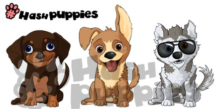

Learn more @ [hashpuppi.es](https://hashpuppi.es), 
twitter: [hash_puppies](https://twitter.com/hash_puppies),
reddit: [HashPuppies](https://www.reddit.com/r/HashPuppies)


### CryptoPets on the Blockchain!  (Upcoming)

The first five animals to be sold off...
Please welcome the Dog, Galapagos Turtle, Giant Panda, T-Rex  and Unicorn  
as the founding species on CryptoPets!

> CryptoPets are the newest breed of animals on the block... blockchain that is. 
> Unlike cryptocurrencies, which require all tokens to be identical, 
> your CryptoPet will be the only one of its kind in the entire world. 
> These cute collectibles are cryptographically unique, non-fungible digital assets. 
> CryptoPets uses the immutability of blockchain technology to verify and prove that each CryptoPet 
> has its own special attributes and is entirely owned by you.  
> Each species will have variations in specific attributes, 
> including fur color, eye shape, paw, and feet type, to name a few.


Learn more @ [cryptopets.co](https://cryptopets.co), 
twitter: [CryptoPets](https://twitter.com/CryptoPets),
reddit: [CryptoPets](https://www.reddit.com/r/CryptoPets)


### CryptoMons(ters) on the Blockchain! (Upcoming)

Collect. Combat. Trade. Digital collectible (monster) cards on the blockchain.

> Every CryptoMons(ter) has his own DNA that defines his aspect and stats: 
> there are no two identical CryptoMons(ter).


Learn more @ [cryptomons.com](http://cryptomons.com), 
twitter: [cryptomons](https://twitter.com/cryptomons)


### CryptoDrome (CryptoHorses) on the Blockchain! (Upcoming)

Collect. Breed. Compete. Raise your own champions.

> We're CryptoHorses, and we were born to compete. Collect and become a champion of the CryptoDrome.

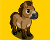

Learn more @ [cryptodrome.co](http://cryptodrome.co), 
twitter: [cryptodrome](https://twitter.com/cryptodrome)

Team:

- **Miguel Ángel Fort** (twitter: [@mafp86](https://twitter.com/mafp86))


### CryptoFighters on the Blockchain! (Upcoming)

Collectible fighters. Level up and start battling.

Learn more @ [cryptofighters.io](http://cryptofighters.io),
twitter: [CryptoFighters](https://twitter.com/CryptoFighters)


### Fishbank / CryptoFish on the Blockchain! (Upcoming)

Grow your fish to the top of food chain!

> Take your place in a decentralized food chain.
> Grow, fight and trade your predatory fish champion
> on the blockchain!
>
> Hunt other fishes and bite off their weight to take top positions in global leaderboards 
> of decentralized deep blue ocean. Trade your winner fish to a better one and grow another champion!

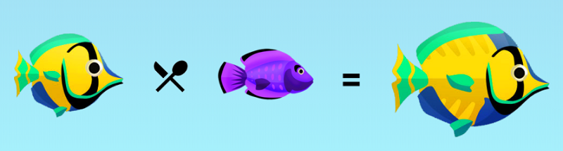

Learn more @ [fishbank.io](https://fishbank.io)

> New Year gift for all the crypto cuties!
> Every owner of Gen 0 asset in any other crypto  pets collectible as of 1th Jan. 2018 
> may request a special gift - the Rare fish token in Fishbank. 
> That is what can be generally referred to as "hardfork effect" in blockchain ecosystems.

Team:

- Chat Robotic @ [chatrobotic.com](http://www.chatrobotic.com), twitter: [chatrobotic](https://twitter.com/chatrobotic)


White Paper V1  ([PDF Download](https://fishbank.io/whitepaper/FISHBANK-V1.pdf)):

**Game concept**

Player owns fishes (those are in fact ERC-721 crypto tokens) each with its unique name, image and
characteristics defined by type. Core fish parameter is weight that defines its size and influence. Main
target is to grow this parameter to become the biggest fish in the ocean.
Fish is able to gain weight only by attacking other fishes, biting off them in case of win.

The more powerful characteristics and the more weight the fish has the
more chance it to win a fight with another fish it represents.

These fishes can be traded or exchanged between players on central fish market.
Every operation in the game is launched and controlled by a contract script.

**The Fish**

Every crypto fish token has its own set of characteristics:

- Weight - Describes the size of the fish
- Power - Damage on attack
- Agility - Defense on attack
- Speed - Cooldown time before attacks

Weight is dynamic characteristic and can be changed within time while Power, Agility and
Speed are called initial parameters those are given to fish from the very moment of creation
and can't be changed in time.

**Rarity**

There are four kinds of rarity assessment  for fishes determined by sum of all
initial fish characteristics:

- Common
- Rare (10+)
- Legendary (15+)
- Epic (25+)


### CryptoTulips on the Blockchain!  (Upcoming)

Learn by Example from the Real World (Anno 1637) - Buy! Sell! Hold! 
Enjoy the Beauty of Admiral of Admirals, Semper Augustus and More.


Learn more @ [openblockchains/tulips](https://github.com/openblockchains/tulips)


### More

<!-- add decentraland ??   virtual land (parcels) on the blockchain and more -->


#### News

**CryptoGames on the Blockchain! News**

See web: [cryptogamer.net](http://www.cryptogamer.net), twitter: [CryptoGamerNet](https://twitter.com/CryptoGamerNet)


### History Corner

_Collectibles on the Blockchain before CryptoKitties_

#### CryptoPunks on the Blockchain!

10 000 unique collectible 8-bit characters with proof of ownership stored on the blockchain. 

> Q: What's a CryptoPunk?
>
> The CryptoPunks are 24x24 pixel art images, generated algorithmically.
> Most are punky-looking guys and girls, but there are a few rarer types mixed in:
> Apes, Zombies and even the odd Alien. 

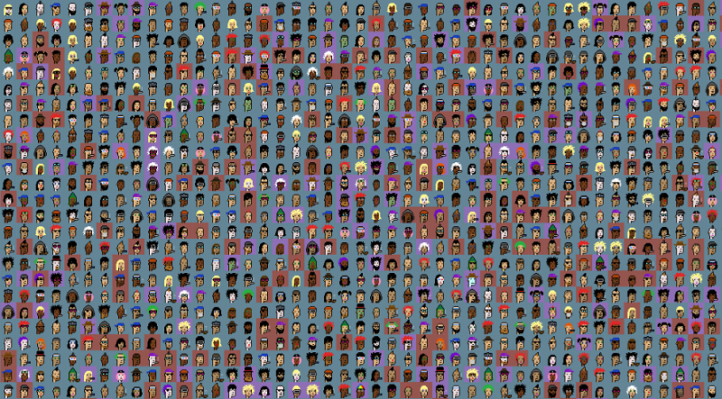

Buy, sell and trade CryptoPunks!

> - [Punk #1812](https://www.larvalabs.com/cryptopunks/details/1812) offered for 1Ξ ($829.51) -- Male, Earring, Nerd Glasses, Normal Beard, Headband
> - [Punk #324](https://www.larvalabs.com/cryptopunks/details/324) new bid 0Ξ ($2.49) -- Female, Hot Lipstick, Earring, Blonde Bob 
> - [Punk #323](https://www.larvalabs.com/cryptopunks/details/323) new bid 0Ξ ($0.83) -- Male, Mohawk Dark 
> - [Punk #1781](https://www.larvalabs.com/cryptopunks/details/1781) offered for 0.14Ξ ($116.13) -- Male, Normal Beard, Headband

Learn more @ [larvalabs.com/cryptopunks](https://www.larvalabs.com/cryptopunks),
github: [larvalabs/cryptopunks](https://github.com/larvalabs/cryptopunks) (contract script sources)


**Q: What's different?**

Too simple. Buy, sell and hodl (collect). That's it. 
Fixed 10 000  collection. No new CyperPunks creation (eg. pairing of genomes) possible. 
No growth. No "mystery" genome and new surprise genes and attributes etc. Where's the fun? :-).


## Meta

**License**


The awesome list is dedicated to the public domain. Use it as you please with no restrictions whatsoever.
