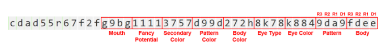
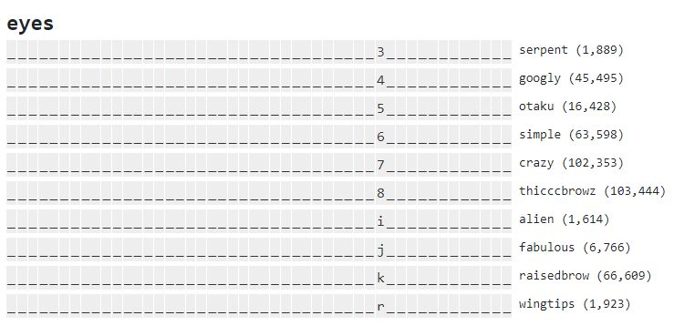
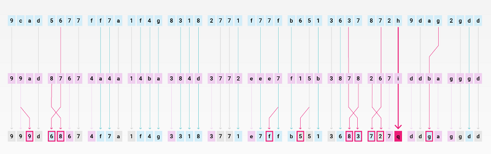

# Inside CryptoKitties Genetics / Genes / Genome


_cdcd 5656 4744 gfg4 66d4 7877 eccf 251j 77k7 222k gddg ddea_


The 256-bit genome (genes) have over 4-billion variations of phenotypes (what you see)
and genotypes (what you don't see).



[**The CryptoKitties Genome Project**](https://medium.com/@kaigani/the-cryptokitties-genome-project-68582016f687) by Kai Turner, Dec 19

> Here's what I've found:
> - Genes are stored in 12 blocks of 4x5-bit codes
> - Each 5-bit code represents a cattribute associated with the position in the gene (body, pattern type, eye color, eye type, primary color, pattern color, secondary color, fancy type, mouth)
> - Each block of 4 codes represents 1 dominant trait expressed in the Kitty followed by 3 recessive traits.
> - Codes are passed from either parent to child, with a low probability of swapping from the 1st recessive, and a lower probability of swapping from the 2nd or 3rd recessive.
> [...]



(Source: [CryptoKittydex, Kaittributes](https://cryptokittydex.com/kaittributes))


[**The CryptoKitties Genome Project: On Dominance, Inheritance and Mutation**](https://medium.com/@kaigani/the-cryptokitties-genome-project-on-dominance-inheritance-and-mutation-b73059dcd0a4) by Kai Turner, Jan 6, 2018 -- Genome, deciphered

> The genome represents 12 groups of 4 genes.
> Each group of 4 genes maps to a given cattribute trait.
> Within each group of 4 genes, there are 3 recessive genes [R1, R2, R3]
> and 1 dominant gene [D1] which will be reflected as a cattribute for that trait,
> represented in the appearance of that kitty.
>
> [...]
>
> Here is a quick sketch of the relative odds of getting a specific gene from the parents
>
> - 75% - either dominant gene [D1] from parent A or B
> - 18.75% (75/4) - chance of getting either 1st recessive [R1] from A or B
> - 4.69% (75/4²) - chance of getting either 2nd recessive [R2] from A or B
> - 1.17% (75/4³) - chance of getting either 3rd recessive [R3] from A or B
> - 25% - chance of getting a mutation given A & B contain the right gene pairs




Q: What's kai notation (base58)?

Kai notation (named to honor Kai who deciphered the kitties genome)
is a base58 variant for decoding the 256-bit integer into 5-bit blocks.
Each 5-bit block is a gene. The 256-bit genome breaks down into 12 groups of 4 (x 5-bit) genes (that is, 12 x 4 x 5-bit = 240 bits)
Example:

|Kai    |Binary |Num|Kai    |Binary |Num|Kai    |Binary |Num|Kai    |Binary |Num|
|-------|-------|---|-------|-------|---|-------|-------|---|-------|-------|---|
| **1** | 00000 | 0 | **9** | 01000 | 8 | **h** | 10000 |16 | **q** | 11000 |24 |
| **2** | 00001 | 1 | **a** | 01001 | 9 | **i** | 10001 |17 | **r** | 11001 |25 |
| **3** | 00010 | 2 | **b** | 01010 | 10| **j** | 10010 |18 | **s** | 11010 |26 |
| **4** | 00011 | 3 | **c** | 01011 | 11| **k** | 10011 |19 | **t** | 11011 |27 |
| **5** | 00100 | 4 | **d** | 01100 | 12| **m** | 10100 |20 | **u** | 11100 |28 |
| **6** | 00101 | 5 | **e** | 01101 | 13| **n** | 10101 |21 | **v** | 11101 |29 |
| **7** | 00110 | 6 | **f** | 01110 | 14| **o** | 10110 |22 | **w** | 11110 |30 |
| **8** | 00111 | 7 | **g** | 01111 | 15| **p** | 10111 |23 | **x** | 11111 |31 |

Note: The digit-0 and the letter-l are NOT used in kai.

> Base58 is a group of binary-to-text encoding schemes used to represent large integers as alphanumeric text.
> It is similar to Base64 but has been modified to avoid both non-alphanumeric characters
> and letters which might look ambiguous when printed [e.g. 1 and l, 0 and o].
> It is therefore designed for human users who manually enter the data,
> copying from some visual source, but also allows easy copy
> and paste because a double-click will usually select the whole string.
>
> [-- Base58 @ Wikipedia](https://en.wikipedia.org/wiki/Base58)


Example - Eyes Gene Mapping (Bits 12 to 15) - Kai-to-Cattributes ("Kaittributes"):

|Kai|Cattribute   |Kai|Cattribute  |Kai|Cattribute  |Kai|Cattribute  |
|---|-------------|---|------------|---|------------|---|------------|
| 1 | ??          | 9 | ??         | h | ??         | q | ??         |
| 2 | wonky       | a | ??         | i | alien      | r | wingtips   |
| 3 | serpent     | b | ??         | j | fabulous   | s | ??         |
| 4 | googly      | c | ??         | k | raisedbrow | t | ??         |
| 5 | otaku       | d | ??         | m | ??         | u | ??         |
| 6 | simple      | e | ??         | n | ??         | v | ??         |
| 7 | crazy       | f | ??         | o | ??         | w | ??         |
| 8 | thicccbrowz | g | stunned    | p | ??         | x | ??         |

Note: ?? - "rare" cattribute not yet seen in kitties


Example - Body Gene Mapping (Bits 0 to 3)  

|Kai|Cattribute   |Kai|Cattribute  |Kai|Cattribute  |Kai|Cattribute  |
|---|-------------|---|------------|---|------------|---|------------|
| 1 | ??          | 9 | ??         | h | ??         | q | ??         |
| 2 | selkirk     | a | cymric     | i | ??         | r | ??         |
| 3 | ??          | b | chartreux  | j | ??         | s | ??         |
| 4 | ??          | c | himalayan  | k | ??         | t | manx       |
| 5 | ??          | d | munchkin   | m | ??         | u | ??         |
| 6 | ??          | e | sphynx     | n | mainecoon  | v | ??         |
| 7 | ??          | f | ragamuffin | o | laperm     | w | ??         |
| 8 | ??          | g | ragdoll    | p | persian    | x | ??         |

Note: ?? - "rare" cattribute not yet seen in kitties


[**CryptoKitties mixGenes Function**](https://medium.com/@sean.soria/cryptokitties-mixgenes-function-69207883fc80) by Sean Soria, Dec 22

> The mixGenes function gets called when you breed two cats. This is how the baby's genes are calculated. [...]
> Here’s the pseudocode to start:

```
def mixGenes(mGenes[48], sGenes[48], babyGenes[48]):
  # PARENT GENE SWAPPING
  for (i = 0; i < 12; i++):
    index = 4 * i
    for (j = 3; j > 0; j--):
      if random() < 0.25:
        swap(mGenes, index+j, index+j-1)
      if random() < 0.25:
        swap(sGenes, index+j, index+j-1)
  # BABY GENES
  for (i = 0; i < 48; i++):
    mutation = 0
    # CHECK MUTATION
    if i % 4 == 0:
      gene1 = mGene[i]
      gene2 = sGene[i]
      if gene1 > gene2:
        gene1, gene2 = gene2, gene1
      if (gene2 - gene1) == 1 and iseven(gene1):
        probability = 0.25
        if gene1 > 23:
          probability /= 2
        if random() < probability:
          mutation = (gene1 / 2) + 16
    # GIVE BABY GENES
    if mutation:
      baby[i] = mutation
    else:
      if random() < 0.5:
        babyGenes[i] = mGene[i]
      else:
        babyGenes[i] = sGene[i]
```


[**CryptoKitties GeneScience algorithm**](https://medium.com/@alexhegyi/cryptokitties-genescience-1f5b41963b0d) by Alex Hegyi, Dec 23

> My winter holiday thus far has consisted of staring at disassembled bytecode
> until I had everything figured out:

``` python

# These examples are from Tx 0xa7b0ac87684771f6d6204a09b5a0bf0b97f6adf61b78138e8fd264828e36b956

# matron.genes
arg1 = 0x000063169218f348dc640d171b000208934b5a90189038cb3084624a50f7316c

# sire.genes
arg2 = 0x00005a13429085339c6521ef0300011c82438c628cc431a63298e3721f772d29

# matron.cooldownEndBlock - 1
arg3 = 0x000000000000000000000000000000000000000000000000000000000047ff27

# BLOCKHASH of block number equal to arg3
blockhash = 0xf9dd4486d68b13839d2f7b345f5223f17abae39a951f2cea5b0ca0dd6dc8db83


# load arguments into bytes arrays in big-Endian order

args1 = []
for cnt in range(32):
    args1.append(arg1//((1<<8)**cnt)&0xff)
args1.reverse()
args1 = bytes(args1)

args2 = []
for cnt in range(32):
    args2.append(arg2//((1<<8)**cnt)&0xff)
args2.reverse()
args2 = bytes(args2)


args3 = []
for cnt in range(32):
    args3.append(arg3//((1<<8)**cnt)&0xff)
args3.reverse()
args3 = bytes(args3)

blockhashes = []
for cnt in range(32):
    blockhashes.append(blockhash//((1<<8)**cnt)&0xff)
blockhashes.reverse()
blockhashes = bytes(blockhashes)

# concatenate bytes arrays

alls =  blockhashes + args1 + args2 + args3


# get hash of bytes arrays. This is your source of "randomness"

hash = sha3.keccak_256(alls)
hash = int.from_bytes(hash.digest(), byteorder = 'big')

print(hex(hash))

# => 0xe30dd999bfba6dd6cd4540fb58c5a1c117e6938c0931459b1c9f6e01d865c19e


# get 5-bit chunks of matron and sire

def masker(arg, start, numbytes):
    mask = 2**numbytes - 1
    mask = mask << start
    out = arg & mask
    out = out >> start

    return out

arg1masks = []
for cnt in range(0x30):
    arg1masks.append(masker(arg1, 5*cnt, 5))

arg2masks = []
for cnt in range(0x30):
    arg2masks.append(masker(arg2, 5*cnt, 5))

arg1maskscopy = arg1masks.copy()
arg2maskscopy = arg2masks.copy()

# note in worst case hashindex wont reach 256 so no need for modulo
hashindex = 0

# swap dominant/recessive genes according to masked_hash
for bigcounter in range(0x0c):
    for smallcounter in range(3, 0, -1):
        count = 4*bigcounter + smallcounter

        masked_hash = masker(hash, hashindex, 2)
        hashindex += 2
        if masked_hash == 0:
            tmp = arg1maskscopy[count - 1]
            arg1maskscopy[count - 1] = arg1maskscopy[count]
            arg1maskscopy[count] = tmp

        masked_hash = masker(hash, hashindex, 2)
        hashindex += 2
        if masked_hash == 0:
            tmp = arg2maskscopy[count - 1]
            arg2maskscopy[count - 1] = arg2maskscopy[count]
            arg2maskscopy[count] = tmp

# combine genes from swapped parent genes, introducing mutations

outmasks = []
for cnt in range(0x30):
    rando_byte = 0

    # mutate only on dominant genes
    if cnt%4 == 0:
        tmp1 = arg1maskscopy[cnt]&1
        tmp2 = arg2maskscopy[cnt]&1

        if tmp1 != tmp2:
            masked_hash = masker(hash, hashindex, 3)
            hashindex += 3

            mask1 = arg1maskscopy[cnt]
            mask2 = arg2maskscopy[cnt]

            # mutate only if the two parent dominant genes differ by 1...
            if abs(mask2 - mask1) == 1:
                min_mask = min(mask1, mask2)
                # and the smaller of the two is even...
                if min_mask % 2 == 0:
                    if min_mask < 0x17:
                        trial = masked_hash > 1
                    else:
                        trial = masked_hash > 0
                    if not trial:
                        # mutation is the smaller of the two parent dominant genes,
                        # divided by two, plus 16
                        rando_byte = (min_mask >> 1) + 0x10

        if rando_byte > 0:
            print(cnt)
            outmasks.append(rando_byte)
            continue

    masked_hash = masker(hash, hashindex, 1)
    hashindex += 1

    if masked_hash == 0:
        outmasks.append(arg1maskscopy[cnt])
    else:
        outmasks.append(arg2maskscopy[cnt])


# this is where we will accumulate the calculated child genes
outs = 0

# this is where you can put the known child genes, for testing
outs2 = 0x5b174298a44b9c6521176000021c53734c9018c431a73298674a5177316c

for cnt in range(0x30):
    outs |= outmasks[cnt] << 5*cnt

# print both for comparison
print(hex(outs))
print(hex(outs2))

# => 0x5b174298a44b9c6521176000021c53734c9018c431a73298674a5177316c
# => 0x5b174298a44b9c6521176000021c53734c9018c431a73298674a5177316c
```

(Source: [Alex Hegyi, CryptoKitties GeneScience](https://github.com/heglex/gene-science/blob/master/Cryptokitties%20mixGenes%20test.ipynb))
